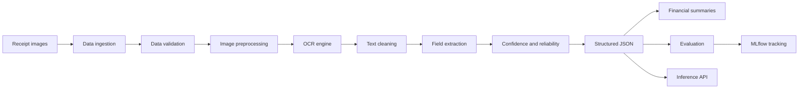
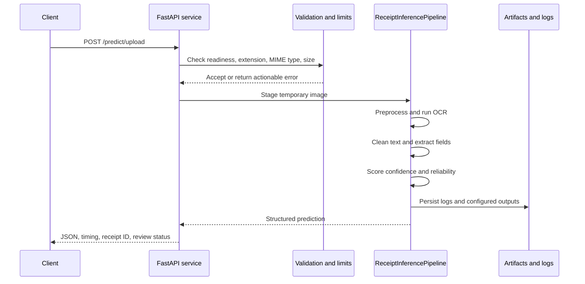
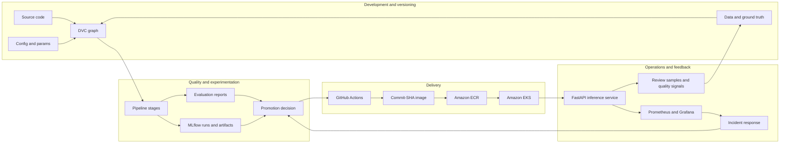
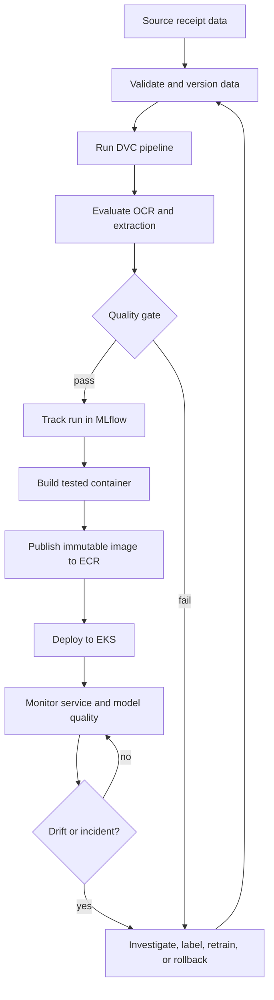

# Receipt Intelligence

> Production-oriented receipt OCR and document intelligence

Turn receipt images into validated, confidence-aware business data with a reproducible MLOps pipeline and a production-style inference API.

[](https://www.python.org/)
[](https://fastapi.tiangolo.com/)
[](https://dvc.org/)
[](https://mlflow.org/)
[](https://www.docker.com/)

[Why this project](#why-this-project) | [Architecture](#architecture) | [Quick start](#quick-start) | [MLOps lifecycle](#mlops-lifecycle) | [Deployment](#deployment) | [Monitoring](#monitoring-and-observability) | [API](#api-reference)

| 12 pipeline stages | 25 MB upload guardrail | 3 health signals | SHA-pinned releases | Prometheus-ready |
| --- | --- | --- | --- | --- |
| Ingestion to inference | File and MIME validation | Live, ready, healthy | Traceable to a commit | ServiceMonitor included |

> **Portfolio signal:** this is an applied document-intelligence system designed to be inspected, evaluated, deployed, monitored, and improved - not only demonstrated once.

## Why this project

Receipt processing is a useful example of applied AI beyond a model demo. The system must handle imperfect images, noisy OCR, ambiguous fields, numeric consistency, quality signals, and operational deployment concerns.

This project demonstrates the complete path from raw receipt images to structured financial summaries:

- Image preprocessing for noisy, skewed, and low-quality receipts
- OCR powered by PaddleOCR
- OCR text normalization and common recognition-error cleanup
- Rule- and pattern-based extraction of stores, dates, line items, and totals
- Field-level confidence and reliability scoring
- Evidence-aware JSON output with review flags
- Financial summaries and audit tables for downstream analysis
- Evaluation against ground-truth data using text, amount, date, and item metrics
- DVC pipeline orchestration and MLflow experiment tracking
- FastAPI inference service with health checks, metrics, batching, and Docker support

## Project snapshot

| Capability | Implementation |
| --- | --- |
| Application | FastAPI + Uvicorn |
| OCR | PaddleOCR / PP-OCRv5 |
| Image processing | OpenCV + Pillow |
| Data and evaluation | NumPy, pandas, scikit-learn |
| Pipeline orchestration | DVC |
| Experiment tracking | MLflow with optional DagsHub tracking |
| Packaging | `pyproject.toml` + setuptools |
| Deployment | Docker, AWS-oriented CI/CD documentation |
| Observability | Health/readiness endpoints and Prometheus instrumentation |
| Supported input | JPG, JPEG, PNG, BMP, TIFF, and WEBP |
| Runtime | Python 3.11 |

## Recruiter walkthrough

The fastest way to review the project is to follow the same path an engineering team would use to assess it:

| Step | Look at | What it demonstrates |
| --- | --- | --- |
| 1 | [`app.py`](app.py) | Typed FastAPI contracts, upload validation, health endpoints, batching, and metrics |
| 2 | [`dvc.yaml`](dvc.yaml) | A 12-stage, dependency-aware data and inference graph |
| 3 | [`config/config.yaml`](config/config.yaml) | Explicit thresholds for preprocessing, extraction, confidence, and evaluation |
| 4 | [`tests`](tests) | API contract and validation behavior without loading the OCR model |
| 5 | [`.github/workflows/aws.yaml`](.github/workflows/aws.yaml) | CI, coverage, Docker smoke test, ECR publication, and EKS rollout |
| 6 | [`deployment/eks`](deployment/eks) | Kubernetes runtime configuration, probes, resources, service exposure, and scraping |
| 7 | `artifacts/` | Inspectable intermediate outputs, evaluation reports, summaries, and inference results |

### Five-minute demo

```powershell
# 1. Install and start the service
pip install -r requirements.txt
uvicorn app:app --host 0.0.0.0 --port 8000

# 2. Inspect the service contract
curl http://localhost:8000/api/info
curl http://localhost:8000/health

# 3. Send a receipt image
curl -X POST "http://localhost:8000/predict/upload" `
  -F "file=@data/inference/receipt.jpg"

# 4. Open interactive documentation
Start-Process http://localhost:8000/api/docs
```

The response makes the business value visible: structured fields, line items, totals, confidence, reliability, review status, receipt ID, and processing time.

## Architecture



The batch pipeline is defined in [`dvc.yaml`](dvc.yaml), while reusable implementation modules live in [`src/receipt_intelligence`](src/receipt_intelligence). Each stage writes inspectable outputs under `artifacts/`, making intermediate results easier to debug and evaluate.

### Runtime request flow



### Output contract

The service intentionally returns operational metadata alongside extracted business data. A representative response shape is:

```json
{
  "success": true,
  "receipt_id": "receipt-001",
  "prediction": {
    "store_name": "EXAMPLE MARKET",
    "date": "2025-01-15",
    "items": [
      {"name": "COFFEE", "price": 10.0}
    ],
    "item_count": 1,
    "item_sum": 10.0,
    "total_amount": 10.0,
    "overall_confidence": 0.96,
    "reliability": "high",
    "review_required": false,
    "status": "success"
  },
  "processing_time_ms": 842.17,
  "timestamp_utc": "2026-09-18T12:00:00+00:00",
  "error": null
}
```

This contract supports both an end-user workflow and an operational workflow: a consumer can display the receipt, while a monitoring or review system can act on confidence, reliability, reconciliation, and timing signals.

### Pipeline stages

| Stage | Responsibility | Representative output |
| --- | --- | --- |
| 1. Data ingestion | Download and unpack the receipt dataset | `artifacts/data_ingestion/` |
| 2. Data validation | Check dimensions, file types, duplicates, and corruption | Validation report |
| 3. Image preprocessing | Grayscale, denoise, CLAHE, deskew, and perspective correction | Preprocessed images |
| 4. OCR engine | Detect and recognize receipt text | OCR result files |
| 5. OCR text cleaning | Normalize whitespace, dates, currency, and OCR errors | Cleaned OCR text |
| 6. Field extraction | Identify store, date, total, and line items | Extracted fields |
| 7. Confidence and reliability | Combine OCR, pattern, context, and consistency signals | Confidence manifest |
| 8. JSON generation | Produce versioned, evidence-aware receipt JSON | Structured JSON |
| 9. Financial summary | Build receipt, audit, store, and transaction summaries | CSV and JSON reports |
| 10. Evaluation | Compare predictions with ground truth | Evaluation report and CSV |
| 11. MLflow tracking | Track experiment metadata and artifacts | MLflow run artifacts |
| 12. Inference | Generate predictions from inference inputs | `predictions.json` |

## Quick start

### Prerequisites

- Python 3.11
- Git
- Optional: Docker Desktop
- Optional: DVC and an MLflow/DagsHub tracking destination

Create and activate a virtual environment:

```powershell
py -3.11 -m venv .venv
.\.venv\Scripts\Activate.ps1
```

Install dependencies:

```powershell
python -m pip install --upgrade pip
pip install -r requirements.txt
pip install -e .
```

### Run the API locally

```powershell
uvicorn app:app --host 0.0.0.0 --port 8000 --reload
```

Open the interactive API documentation at [http://localhost:8000/api/docs](http://localhost:8000/api/docs).

Useful service checks:

```powershell
curl http://localhost:8000/health
curl http://localhost:8000/health/live
curl http://localhost:8000/api/info
```

### Run the reproducible pipeline

Run all DVC stages from ingestion through inference:

```powershell
dvc repro
```

Run a single stage when iterating locally:

```powershell
python -m src.receipt_intelligence.pipeline.stage_04_ocr_engine
```

The full stage list and dependencies are visible in [`dvc.yaml`](dvc.yaml). Parameters and thresholds are centralized in [`config/config.yaml`](config/config.yaml) and [`params.yaml`](params.yaml).

### Run tests

```powershell
pytest
```

The API contract tests cover OpenAPI availability, Swagger docs, upload validation, and empty-file handling. The test suite uses a mock inference object so API behavior can be checked without loading the OCR model.

## API reference

The service exposes OpenAPI documentation at `/api/docs` and `/api/openapi.json`.

| Method | Endpoint | Purpose |
| --- | --- | --- |
| `GET` | `/` | Serve the browser interface |
| `GET` | `/health` | Report model and pipeline health |
| `GET` | `/health/live` | Kubernetes/Docker liveness check |
| `GET` | `/health/ready` | Readiness check; returns `503` until ready |
| `GET` | `/metrics` | Prometheus metrics |
| `GET` | `/api/info` | Service metadata and supported formats |
| `GET` | `/api/pipeline/info` | Active pipeline and model paths |
| `GET` | `/api/artifacts` | Artifact availability and paths |
| `POST` | `/predict` | Predict from a local image path |
| `POST` | `/predict/upload` | Predict from an uploaded receipt image |
| `POST` | `/predict/batch` | Predict from multiple image paths |
| `POST` | `/predict/directory` | Predict over a directory of images |

### Upload example

```powershell
curl -X POST "http://localhost:8000/predict/upload" `
  -F "file=@data/inference/receipt.jpg"
```

Responses include a success flag, receipt ID, extracted prediction, processing time, timestamp, and any review or reliability signals produced by the pipeline. Uploads are restricted to supported image types and a maximum size of 25 MB.

## Docker

Build and run the production-style container:

```powershell
docker build -t receipt-intelligence:latest .
docker run --rm -p 8000:8000 receipt-intelligence:latest
```

The image uses Python 3.11, runs as a non-root `appuser`, exposes port `8000`, and includes a health check against `/health/live`.

## Configuration and experiment tracking

Pipeline behavior is configuration-driven:

- [`config/config.yaml`](config/config.yaml): dataset paths, preprocessing behavior, OCR thresholds, extraction rules, confidence weights, evaluation tolerances, and output locations
- [`params.yaml`](params.yaml): experiment and model parameters
- [`dvc.yaml`](dvc.yaml): stage commands, dependencies, and tracked outputs
- `.env` or shell environment: local secrets and external service configuration

For remote MLflow tracking, configure credentials in the shell environment rather than committing them to source control:

```powershell
$env:MLFLOW_TRACKING_URI = "https://<tracking-host>/<experiment>.mlflow"
$env:MLFLOW_TRACKING_USERNAME = "<username>"
$env:MLFLOW_TRACKING_PASSWORD = "<token-or-password>"
```

Do not place passwords, access keys, or tokens in `README.md`, `config.yaml`, or committed workflow files.

## Engineering highlights

### Reliability-aware extraction

The system does not treat OCR output as automatically correct. Confidence is calculated from OCR quality, extraction patterns, contextual evidence, and consistency checks such as item-count and total reconciliation. Low-confidence receipts can be marked for review instead of silently entering financial summaries.

### Operational API design

The API separates liveness from readiness, reports model state, returns processing time, validates upload types and sizes, supports batch workflows, and exposes metrics for monitoring. This makes the inference layer easier to deploy behind a container platform or service gateway.

### Reproducible experimentation

DVC captures the data-to-output graph, MLflow records experiment artifacts, and evaluation outputs are persisted as both JSON and CSV. The result is a workflow that can be rerun, inspected stage by stage, and improved without losing traceability.

### Maintainable project structure

```text
.
├── app.py                         # FastAPI application and API contracts
├── config/                        # Central pipeline configuration
├── data/                          # Ground truth and inference inputs
├── artifacts/                     # Stage outputs and evaluation reports
├── notebooks/                     # Exploratory and stage-level analysis
├── src/receipt_intelligence/
│   ├── components/                # Data, OCR, extraction, evaluation logic
│   ├── pipeline/                  # Executable pipeline stages
│   ├── config/                    # Configuration management
│   ├── entity/                    # Typed configuration entities
│   └── utils/                     # Shared utilities and logging
├── static/                        # Web UI assets
├── templates/                     # Web UI templates
├── tests/                         # API and validation tests
├── Dockerfile
├── dvc.yaml
├── params.yaml
└── pyproject.toml
```

## Deployment direction

The repository includes Docker and AWS-oriented deployment material for a CI/CD flow built around:

1. Build and test the container
2. Push the image to Amazon ECR
3. Deploy the image to a compute target such as EC2 or EKS
4. Use health checks for rollout validation
5. Store credentials in GitHub Actions secrets or the deployment platform's secret manager

The deployment approach can be adapted to a managed Kubernetes service, an ECS service, or a VM-based container host depending on operational requirements.

## MLOps lifecycle

This project treats receipt intelligence as a lifecycle rather than a one-time script. The lifecycle connects data quality, reproducibility, evaluation, deployment, observability, and feedback into one operating model.

### MLOps control plane



### MLOps capability map

| Capability | Baseline in this repository | Next production step |
| --- | --- | --- |
| Reproducibility | DVC stage dependencies and tracked artifacts | Remote DVC storage with immutable dataset versions |
| Experimentation | MLflow run and artifact tracking | Registered model/component versions with approval stages |
| Quality | Evaluation reports and configurable thresholds | Enforced promotion gates and slice-based reports |
| Delivery | GitHub Actions, Docker, ECR, EKS | Staging environment, canary release, signed images |
| Runtime health | Liveness, readiness, health, metrics | SLOs, alert rules, traces, and on-call ownership |
| Data feedback | Confidence and review signals | Human-labeling queue and automated drift reports |
| Recovery | SHA-tagged images and Kubernetes rollback | Tested rollback playbook and disaster recovery exercise |



### Lifecycle ownership by repository surface

| MLOps concern | Repository surface | Outcome |
| --- | --- | --- |
| Configuration | [`config/config.yaml`](config/config.yaml), [`params.yaml`](params.yaml) | Centralized, reviewable thresholds and paths |
| Data lineage | [`dvc.yaml`](dvc.yaml), `data/`, `artifacts/` | Reproducible input-to-output graph |
| Pipeline execution | `src/receipt_intelligence/pipeline/` | Independently runnable stages |
| Data and model logic | `src/receipt_intelligence/components/` | Testable processing components |
| Experiment tracking | MLflow component and `artifacts/mlflow/` | Run metadata and artifacts |
| Evaluation | `artifacts/evaluation/` | JSON, CSV, and detailed quality results |
| Service contract | [`app.py`](app.py) | Typed API responses and health states |
| Continuous integration | [`.github/workflows/aws.yaml`](.github/workflows/aws.yaml) | Tests, compile checks, image build, smoke test |
| Continuous delivery | [`.github/workflows/aws.yaml`](.github/workflows/aws.yaml) | ECR publication and EKS rollout |
| Runtime deployment | [`deployment/eks`](deployment/eks) | Kubernetes workload, service, and monitoring integration |

### Data lifecycle

1. **Ingest**: the configured source dataset is downloaded and unpacked into `artifacts/data_ingestion/`.
2. **Validate**: dimensions, extensions, file sizes, duplicates, and corruption are checked before downstream processing.
3. **Transform**: preprocessing creates normalized receipt images without modifying the original input.
4. **Extract**: OCR text is cleaned and transformed into receipt fields and line items.
5. **Qualify**: confidence, reliability, evidence, and review flags are attached to the extracted result.
6. **Summarize**: accepted results become receipt, audit, store, and transaction summaries.
7. **Evaluate**: predictions are compared with ground truth using text, amount, date, and item-level checks.
8. **Version**: DVC tracks the stage graph and output directories so a run can be reproduced after code or parameter changes.

### Quality gates

The evaluation configuration already defines warning thresholds and target accuracies for important receipt fields. A production promotion gate should evaluate at least:

| Gate | Why it matters | Example decision |
| --- | --- | --- |
| Corpus CER/WER | Detect OCR transcription regressions | Reject if text error exceeds the configured maximum |
| Store accuracy | Vendor identity drives reporting and reconciliation | Block promotion when accuracy falls below target |
| Date accuracy | Dates affect accounting periods and spend analysis | Block promotion on systematic date drift |
| Total accuracy | Totals are financially material | Require strict amount tolerance |
| Item F1 | Measures line-item extraction quality | Reject if item extraction degrades |
| Review rate | Controls manual-review workload | Investigate sudden increases |
| Reconciliation rate | Checks item sum versus receipt total | Investigate financial inconsistencies |

The current configuration has `quality_gate_enabled: False`, so the evaluation stage can report quality without automatically blocking the pipeline. Enabling a gate should be paired with a documented baseline and an approval process for threshold changes.

## Continuous integration

The GitHub Actions workflow is triggered for pull requests and pushes to `main`. README-only changes are excluded from push-triggered deployment runs.

### Pull request and integration checks

The `integration` job performs the following sequence:

1. Checks out the repository.
2. Installs Python 3.11 with pip caching.
3. Installs dependencies from `requirements.txt`.
4. Verifies critical imports, including the FastAPI application.
5. Compiles `app.py` and `src` with `compileall`.
6. Runs the test suite with coverage and JUnit XML output.
7. Builds the Docker image with `--pull`.
8. Starts the image as a disposable container.
9. Polls `/health/live` until the service becomes alive.
10. Verifies `/health` and `/api/info` before cleaning up the container.

This catches failures at multiple boundaries: dependency resolution, import-time errors, Python syntax, API behavior, image construction, process startup, and runtime health.

### CI artifacts

The workflow uploads test results, `coverage.xml`, and the HTML coverage directory when available. These artifacts make a failed build easier to diagnose without reproducing the runner environment locally.

### Recommended CI hardening

For a production pipeline, add the following gates before publishing an image:

- Ruff or another static analysis tool
- Black format verification
- Dependency vulnerability scanning
- Container image scanning with a severity threshold
- Secret scanning and IaC scanning for Kubernetes manifests
- DVC pipeline execution on a representative fixture or scheduled data run
- Evaluation quality gates for OCR and extracted financial fields
- SBOM generation and image signing

## Deployment

### Container release strategy

Every successful `main` build creates two ECR tags:

- An immutable commit-SHA tag: `${GITHUB_SHA}`
- A convenience `latest` tag

The EKS deployment uses the immutable SHA tag, which makes the running version traceable to a source commit and avoids deploying a moving tag. The workflow verifies that the image exists in ECR before applying Kubernetes resources.

### AWS and ECR prerequisites

The current workflow expects these GitHub repository values and secrets:

| Name | Type | Purpose |
| --- | --- | --- |
| `AWS_REGION` | Repository variable | AWS region used by ECR and EKS |
| `ECR_REPOSITORY_NAME` | Repository variable | Target ECR repository |
| `AWS_ACCESS_KEY_ID` | Repository secret | AWS authentication for the workflow |
| `AWS_SECRET_ACCESS_KEY` | Repository secret | AWS authentication for the workflow |

The AWS identity must be allowed to describe and push to the ECR repository and to inspect and update the target EKS cluster. Keep these values in GitHub secrets; never write them into YAML, source code, or README examples.

For a hardened organization, replace long-lived access keys with GitHub Actions OIDC federation and a narrowly scoped IAM role. The role should be limited to the repository, branch, AWS account, ECR repository, and EKS resources required by the deployment.

### Provision the EKS cluster

The repository includes an `eksctl` cluster definition at [`deployment/eks/cluster.yaml`](deployment/eks/cluster.yaml):

```bash
eksctl create cluster -f deployment/eks/cluster.yaml
```

The current learning-oriented cluster definition uses:

- Cluster name: `receipt-ocr-cluster`
- Region: `us-east-1`
- Managed node group: `receipt-ocr-workers`
- Instance type: `t3.medium`
- Capacity: 1 desired node, scaling to 2
- 30 GB gp3 worker volumes
- Private node networking

Review cost, scaling, availability zones, encryption, IAM, and network policy before using this configuration for production workloads.

### Deploy manually to EKS

After configuring AWS credentials and kubeconfig:

```bash
aws eks update-kubeconfig \
  --region us-east-1 \
  --name receipt-ocr-cluster

kubectl apply -f deployment/eks/namespace.yaml
kubectl apply -f deployment/eks/service.yaml
```

The Deployment contains `IMAGE_URI_PLACEHOLDER`, so substitute a fully qualified ECR image before applying it:

```bash
export IMAGE_URI="<account>.dkr.ecr.us-east-1.amazonaws.com/<repository>:<commit-sha>"
sed "s|IMAGE_URI_PLACEHOLDER|${IMAGE_URI}|g" \
  deployment/eks/deployment.yaml > /tmp/receipt-ocr-deployment.yaml
kubectl apply -f /tmp/receipt-ocr-deployment.yaml
kubectl rollout status deployment/receipt-ocr-api \
  --namespace receipt-ocr --timeout=10m
```

Inspect the rollout:

```bash
kubectl get deployment,pods,service -n receipt-ocr
kubectl describe deployment receipt-ocr-api -n receipt-ocr
kubectl logs deployment/receipt-ocr-api -n receipt-ocr --tail=100
```

The current Service is `type: LoadBalancer`, exposing port 80 externally and forwarding to port 8000 in the container. The repository does not currently include an Ingress or TLS manifest; production deployments should normally place an authenticated HTTPS ingress or API gateway in front of the service.

### Kubernetes runtime controls

The current Deployment includes several useful operational controls:

| Control | Current behavior | Operational value |
| --- | --- | --- |
| Replica count | 1 | Simple baseline; not highly available |
| Strategy | `Recreate` | Avoids overlapping OCR model processes |
| Resource request | 500m CPU, 2 GiB memory | Schedules capacity for model startup |
| Resource limit | 1500m CPU, 3 GiB memory | Prevents unbounded resource usage |
| Startup probe | `/health/live`, up to 10 minutes | Allows slow OCR/model initialization |
| Readiness probe | `/health/ready` | Keeps unready pods out of service traffic |
| Liveness probe | Process check | Restarts a dead process |
| Termination grace | 30 seconds | Allows in-flight requests to finish |
| Security context | No privilege escalation, drop all capabilities | Reduces container privilege |

For higher availability, move to at least two replicas, use a rolling strategy, add a PodDisruptionBudget, spread pods across nodes or zones, and verify that model startup time and memory usage support the rollout behavior.

### Deployment verification

The CI/CD workflow verifies the deployment in stages:

1. Confirms the AWS identity and EKS cluster status.
2. Configures `kubectl` and lists nodes.
3. Confirms the SHA-tagged image exists in ECR.
4. Applies the namespace, Deployment, and Service.
5. Waits for `kubectl rollout status` to succeed.
6. Prints pods, deployment details, and service state.
7. Waits for the AWS LoadBalancer hostname.
8. Prints recent application logs for post-deploy inspection.

For a stronger release gate, add an external smoke test against the LoadBalancer hostname, verify `/health/ready`, upload a known non-sensitive fixture, and fail the workflow when the prediction contract is invalid.

### Rollback and incident recovery

Because deployments use commit-SHA image tags, rollback can target a known-good revision:

```bash
kubectl rollout history deployment/receipt-ocr-api -n receipt-ocr
kubectl rollout undo deployment/receipt-ocr-api -n receipt-ocr
kubectl rollout status deployment/receipt-ocr-api \
  -n receipt-ocr --timeout=10m
```

If the issue is image-specific and the desired revision is known, update the image explicitly:

```bash
kubectl set image deployment/receipt-ocr-api \
  receipt-ocr-api=<account>.dkr.ecr.us-east-1.amazonaws.com/<repository>:<known-good-sha> \
  -n receipt-ocr
```

After rollback, check pod events, logs, readiness, request failures, latency, and extracted-field quality. Record the incident, affected image tag, start and recovery times, user impact, and follow-up action.

## Monitoring and observability

Monitoring must cover both **service health** and **receipt quality**. A process can be alive while returning poor OCR or financially incorrect totals, so infrastructure dashboards alone are insufficient.

### Health endpoints

| Endpoint | Signal | Expected use |
| --- | --- | --- |
| `/health/live` | Process is alive | Kubernetes liveness and Docker health check |
| `/health/ready` | Inference pipeline is initialized | Kubernetes readiness and traffic gating |
| `/health` | Model loaded, pipeline ready, version, timestamp | Operator dashboard and deployment verification |
| `/api/info` | Service capabilities and limits | Smoke tests and client discovery |
| `/api/pipeline/info` | Active pipeline and model paths | Debugging artifact/model configuration |
| `/api/artifacts` | Artifact path existence | Runtime diagnostics |
| `/metrics` | Prometheus exposition endpoint | Time-series monitoring |

Readiness deliberately returns `503` until the inference pipeline is ready. This prevents traffic from being routed to a pod that has started its process but has not finished model initialization.

### Service-level indicators

Track these metrics by endpoint, status code, and deployment version:

| SLI | Measurement | Example alert condition |
| --- | --- | --- |
| Availability | Successful requests / total requests | Sustained 5xx or readiness failures |
| Latency | p50, p95, and p99 processing time | p95 exceeds the agreed target |
| Throughput | Requests and receipts processed per minute | Unexpected traffic drop or saturation |
| Error rate | 4xx and 5xx rate | Sudden increase after a release |
| Saturation | CPU, memory, pod restarts, throttling | Resource limit or restart trend |
| Startup health | Time to ready and failed startups | Model initialization regression |
| Queue pressure | Batch size and processing duration | Backlog or timeout risk |

The application already exposes Prometheus-compatible metrics through `prometheus_fastapi_instrumentator`. The EKS repository also includes [`deployment/eks/servicemonitor.yaml`](deployment/eks/servicemonitor.yaml), which scrapes `/metrics` every 15 seconds when the Prometheus Operator is installed and configured with the matching `release: monitoring` label.

Apply the ServiceMonitor only after the monitoring stack is available:

```bash
kubectl apply -f deployment/eks/servicemonitor.yaml
kubectl get servicemonitor -n monitoring
```

### Dashboard layout

A practical Grafana dashboard should have four rows:

1. **Release health**: current image SHA, pod count, ready replicas, restart count, and deployment age.
2. **API behavior**: request rate, status-code distribution, p50/p95/p99 latency, and endpoint-level failures.
3. **Runtime capacity**: CPU, memory, throttling, node capacity, container restarts, and startup duration.
4. **Document quality**: confidence distribution, review-required rate, OCR error metrics, total reconciliation rate, and field accuracy from sampled or labeled data.

### Alert tiers

| Severity | Example trigger | Response |
| --- | --- | --- |
| Critical | No ready replicas or sustained service unavailability | Page immediately; rollback or restore capacity |
| High | 5xx spike, readiness failures, or memory exhaustion | Investigate current release and runtime logs |
| Medium | p95 latency, restart count, or review rate rising | Open an engineering ticket and inspect trends |
| Low | Confidence distribution or data mix slowly changing | Schedule data-quality or retraining review |

Alert thresholds should be based on a recorded baseline rather than arbitrary values. Use a multi-window rule where possible to reduce noisy alerts, for example a fast burn-rate alert for urgent outages and a slower trend alert for degradation.

### Logging and tracing

Application logs should be centralized from Kubernetes stdout/stderr and correlated with:

- Request ID
- Endpoint and HTTP status
- Image or receipt identifier, avoiding raw sensitive image content
- Deployment image SHA
- Processing duration
- Pipeline/model version
- Failure category and safe exception detail

Do not log uploaded receipt images, full OCR text, access tokens, or unnecessary personal or financial data. For distributed environments, add OpenTelemetry tracing around upload staging, preprocessing, OCR, extraction, and response serialization while redacting receipt content.

## Model and data quality monitoring

### Online quality signals

The prediction response and generated JSON already provide useful signals for monitoring:

- Overall confidence
- Reliability classification
- Review-required flag
- OCR and extraction evidence
- Item count and expected item count
- Item sum versus total amount
- Validation status
- Processing duration

Aggregate these values by deployment version, source channel, store, image characteristics, and time window. A rising review-required rate can reveal a camera, supplier, layout, or preprocessing problem before a labeled accuracy report is available.

### Drift monitoring

Receipt data can drift when stores change layouts, currencies, fonts, printers, or image capture devices. Monitor:

| Drift area | Example feature | Detection approach |
| --- | --- | --- |
| Image quality | Width, height, file size, brightness, blur, skew | Distribution comparison against baseline |
| OCR behavior | Text length, token count, OCR confidence | Quantiles and confidence histograms |
| Field presence | Missing store, date, total, or items | Missingness-rate comparison |
| Financial values | Amount ranges and currency patterns | Range checks and distribution drift |
| Layout mix | Receipt aspect ratio and line count | Clustering or bucketed proportions |
| Human review | Review-required and correction rate | Control chart over time |

Keep a baseline dataset and compare a recent window against it. For labeled samples, calculate CER, WER, field accuracy, amount error, item precision/recall/F1, and calibration of confidence scores. For unlabeled traffic, use proxy signals and route representative samples for human review.

### Retraining and recalibration loop

1. Capture representative failures with consent and appropriate retention controls.
2. Redact or tokenize sensitive receipt information where possible.
3. Add verified labels and record the data version.
4. Run data validation before using the sample for evaluation or training.
5. Execute the DVC pipeline with the proposed configuration or component change.
6. Compare the candidate against the production baseline in MLflow.
7. Check overall metrics and important slices such as store, image quality, and receipt layout.
8. Review confidence calibration and manual-review workload.
9. Promote only when the candidate passes quality, security, and operational gates.
10. Deploy with a known image SHA and monitor the first production window closely.

## Security and governance

### Secrets and identity

- Store AWS, MLflow, registry, and database credentials in a secret manager or GitHub Actions secrets.
- Prefer short-lived OIDC role assumption over long-lived AWS access keys.
- Use separate AWS accounts or roles for development, staging, and production.
- Scope ECR and EKS permissions to the smallest required resource set.
- Rotate credentials and audit access regularly.

### Supply chain

- Pin application dependencies where practical and review upgrades deliberately.
- Scan dependencies and the Docker image for known vulnerabilities.
- Generate an SBOM for release images.
- Sign images and verify signatures before admission to the cluster.
- Deploy immutable commit-SHA tags rather than relying on `latest`.
- Protect the `main` branch and require passing CI checks before merge.

### Data protection

- Treat receipt images, OCR text, vendor names, dates, and totals as sensitive business data.
- Encrypt data in transit and at rest.
- Define retention and deletion policies for uploads, intermediate OCR, artifacts, and logs.
- Restrict artifact and MLflow access by role.
- Redact sensitive fields from logs and observability payloads.
- Validate that the dataset license permits the intended use and redistribution.

### API production controls

The current service validates extensions, MIME types, and a 25 MB upload limit. A public deployment should additionally provide authentication, authorization, rate limiting, request quotas, malware scanning, TLS termination, CORS review, and protection against path traversal and oversized decompression payloads.

## Production readiness checklist

### Before first deployment

- [ ] Pin and scan dependencies.
- [ ] Configure AWS and MLflow secrets outside source control.
- [ ] Create the ECR repository and EKS cluster.
- [ ] Confirm the cluster has sufficient CPU and memory for PaddleOCR startup.
- [ ] Install a Prometheus/Grafana stack if using the ServiceMonitor.
- [ ] Define a baseline for latency, error rate, confidence, and review rate.
- [ ] Verify the test dataset contains no sensitive production receipts.

### Before each release

- [ ] Review the change, configuration diff, and DVC stage dependencies.
- [ ] Run tests, compile checks, and the Docker smoke test.
- [ ] Run evaluation against the current baseline.
- [ ] Confirm no secrets or sensitive artifacts are included in the image.
- [ ] Publish and verify the commit-SHA image in ECR.
- [ ] Deploy to a staging namespace or environment when available.
- [ ] Verify liveness, readiness, API contract, and a known fixture.

### After deployment

- [ ] Confirm rollout completion and ready replicas.
- [ ] Verify the service and LoadBalancer state.
- [ ] Check logs for startup errors and unexpected warnings.
- [ ] Confirm Prometheus is scraping the `/metrics` endpoint.
- [ ] Watch latency, error rate, memory, restarts, and review-required rate.
- [ ] Record the deployed image SHA and release owner.
- [ ] Keep the previous known-good image available for rollback.

### During an incident

- [ ] Identify whether the problem is availability, latency, infrastructure, data quality, or model quality.
- [ ] Check the current image SHA, pod events, readiness state, and recent logs.
- [ ] Compare current metrics with the release baseline.
- [ ] Roll back to the last known-good image when user impact is ongoing.
- [ ] Preserve relevant logs, metrics, request IDs, and evaluation artifacts.
- [ ] Communicate impact, mitigation, owner, and next update time.
- [ ] Create a post-incident action with a test or monitor that prevents recurrence.

## Security notes

- Keep cloud and MLflow credentials outside the repository.
- Treat uploaded receipt images and extracted financial data as sensitive business data.
- Put authentication, authorization, rate limiting, and encrypted storage in front of the service for production use.
- Review the dataset and artifact licenses before redistributing them.

## License

This project is released under the MIT License. See [`LICENSE`](LICENSE).

## Contact

### Ajay Chaudhary

This project is designed as a portfolio demonstration of applied OCR, document intelligence, data quality, evaluation, and MLOps engineering.
